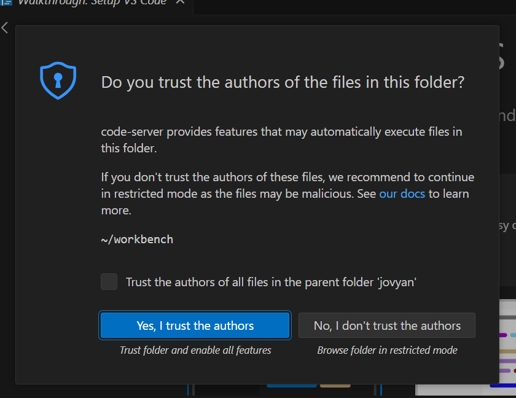
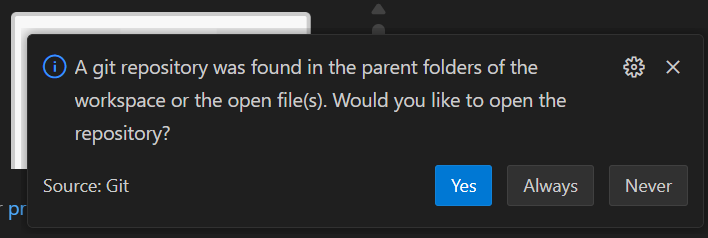
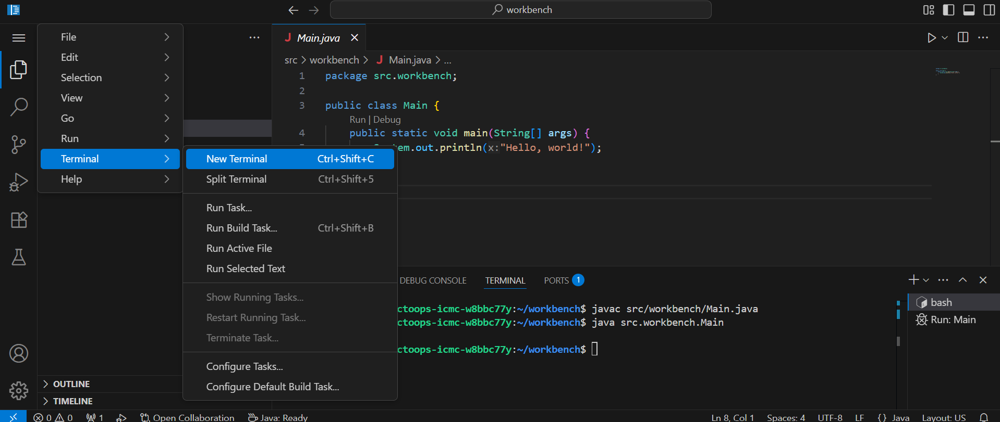

# <DateTitle offset=0 />

- Introductions
- Resources
- Schedule
- Coding Setup
- Hello World
- *Break*
- About Java and Python
- Variables and Basic I/O
- Common Errors and Debugging
- *Worksheet*

---

## Introductions

**Hello!**

Message us on Discord or send an email to the following addresses:
- <code><Obfuscate ob="aW93YWNpdHltYXRoY2lyY2xlQGdtYWlsLmNvbQo=" /></code>
- <code><Obfuscate ob="YWxleHlhbzJAaWxsaW5vaXMuZWR1Cg==" /></code>

<!-- We'll be using two programming languages. Transitioning from Python to Java, but still including Python. -->

---
layout: two-cols-header
---

## Resources

Bookmark this slides presentation to following along!  
<PageURL />

Helpful cheatsheets to reference:
- <Link to="unavailable">Java Cheatsheet</Link>
- <Link to="unavailable">Python Cheatsheet</Link>

::left::

<iframe src="unavailable" />

::right::

<iframe src="unavailable" />

---

## Schedule

### Week 1 - Foundations - <DateTitle offset=0 /> to <DateTitle offset=4 />

| <DateTitle offset=0 /> | <DateTitle offset=1 /> | <DateTitle offset=2 /> | <DateTitle offset=3 /> | <DateTitle offset=4 /> |
| :---: | :---: | :---: | :---: | :---: |
| Variables, Data Types, I/O | Using Data Types and Variables | Arrays, Functions, Intro to Classes, Control Flow | Data Structures, ADTs, Polymorphism | Call Stacks, Recusion |

### Week 2 - Projects - <DateTitle offset=7 /> to <DateTitle offset=11 />

| <DateTitle offset=7 /> | <DateTitle offset=8 /> | <DateTitle offset=9 /> | <DateTitle offset=10 /> | <DateTitle offset=11 /> |
| :---: | :---: | :---: | :---: | :---: |
| ANSI Escape Sequences | Lambdas, File I/O | Time, Networking | GUIs, Multithreading | Project Presentations |

<v-click>

### Worksheets

- Worksheets will be frequently assigned, but <span v-mark.underline.pink="+1">are not graded</span>.
- You may check your answers against the answer keys.
- <span v-mark.underline.pink="+1">Both will be posted on these slides.</span>

</v-click>

---

## Setup

<v-clicks>

<div>

- Click on the button below to open up a **Binder**.

<AutoFitText min=0 max=1>
<span v-mark.circle.pink="1">

[](https://mybinder.org/v2/gh/ObjectOops/icmc/HEAD?urlpath=vscode)

</span>
</AutoFitText>

**Always use this button to open Binder.**

</div>

- We will use Binders during camp. <span text-sm>*The Binder service is generously provided for free, but we don't want to overuse it.*</span>

<div>

- When programming outside of class, here are some other options:
  1. Install an editor + Java and/or Python on a non-Chromebook device.<br>
  <span text-sm>You can ask us for guidance.</span>
  2. [Replit](https://replit.com/)
  3. [JavaFiddle](https://javafiddle.leaningtech.com/) (Java)
  4. [JupyterLite](https://jupyterlite.rtfd.io/en/stable/try/lab) (Python)

</div>

</v-clicks>

<!-- Binder, JavaFiddle, and JupyterLite don't save your files since they don't require an account. -->

---
layout: two-cols-header
---

### Using Binder

> <span text-sm>Instructor Guided</span>

::left::

<Transform scale=0.75>
<v-clicks>

<span text-2xl>1. Click "Yes, I trust the authors"</span>


<span text-2xl>2. Click "Never"</span>


</v-clicks>
</Transform>

::right::

<div text-sm>
<v-click>

Create a new terminal to run *commands*.



</v-click>
<v-click>

**Compile** Command: `javac src/workbench/Main.java`  
**Run** Command: `java src.workbench.Main`  
You must always <span v-mark.underline.pink="4">**compile** before **running**</span>.

</v-click>
<v-click>

Use the run button to **compile** and **run** in one step!

</v-click>
<v-click>

Tip: For Python you just need to use the command  
`python main.py`.

</v-click>
</div>

<!-- Students should now run Hello World! -->

---

## Break

Have a break!

<RandomPicture />

---
layout: two-cols-header
---

## About Java and Python

### Java <logos-java />

::left::

<v-clicks depth=2>

- Java 1.0 was released in 1996
  - Not that old, still very popular
- Originally designed for TV
- Versions: 1.0, 1.1, ..., 1.4, <v-click hide at="5">?</v-click><v-click at="5">5.0, 6, 7, ...</v-click>
- <span text-sm>Versions you should care about (LTS):</span> 8, 11, 17, 21
- <span v-mark.underline.purple="6" border>**Java <logos-java /> and JavaScript <logos-javascript /> are different!**</span>

</v-clicks>
<v-click>


</v-click>

::right::

<v-click>

#### FIRST Robotics

There are many high school robotics teams around Iowa City that use **Java**!  
*Consider joining one!*

**FTC** Teams:
- West High: Trobotix 8696
- City High: Raw Bacon 8743
- Liberty High: ThunderBots 22064

**FRC** Team:  
- Iowa City: Children of the Corn 167

</v-click>

---
zoom: 0.7
---

|  |  |  |
| :---: | :---: | :---: |
|  |  |  |

<SlidevVideo controls>
  <source src="./robot.mp4" type="video/mp4" />
  <p>Your browser does not support this video.</p>
</SlidevVideo>

---
layout: two-cols
---

### Python <logos-python />

<v-clicks>

- Python 0.9.0 was released in 1991
- Two variants: Python 2 & Python 3
  - Don't use 2, use 3
- As of writing this slide, the latest version is **3**.13.5
- We will mainly be using Java (it's more straight forward)
  - Python is handy for some things

</v-clicks>

Animations made with Python! <carbon-arrow-right />

::right::

<SlidevVideo autoplay loop controls>
  <source src="https://www.manim.community/examples/ContinuousMotion.webm" type="video/webm" />
  <p>Your browser does not support this video.</p>
</SlidevVideo>

<SlidevVideo autoplay loop controls>
  <source src="https://www.manim.community/examples/OpeningManim.webm" type="video/webm" />
  <p>Your browser does not support this video.</p>
</SlidevVideo>

---
layout: two-cols-header
---

## Explanation

::left::


::right::


---

<logos-java />

```java {all|1|3,4,6,7|4,6|5|9-13|all}
package src.workbench; // Main.java is in a folder called workbench, which is in a folder called src.

public class Main { // You can think of the Main class as the command center of the program.
    public static void main(String[] args) { // The main function is where your code starts executing.
        System.out.println("Hello, world!"); // Outputs: Hello, world!
    }
}

// This is a comment. It will be ignored by the program.
/*
This comment
can be on multiple lines.
*/
```

<logos-python />

```py {none|1,2|4-8|all}
print("Hello, world!") # In Python, any file can run on its own.
# Python starts running immediately from line 1.

# This is a comment.
"""
This comment
can be on multiple lines.
"""
```

<!-- Note that the double quotes for strings are necessary, but won't be printed! -->

---
zoom: 0.9
---

## Keyboard Map

<span text-sm>Some keys you might have never used before.</span>


<div font-mono text-3xl text-center>! @ # % ^ & * () _ {} [] ; / \ |</div>

---

## Variables

<v-clicks>

- A variable represents a piece of data
- Every piece of data has a **type**
  - The most basic types are called **primitive types**

| *Groups* | Integers | Floating-Point | Boolean | Characters |
| :--- | :--- | :--- | :--- | :--- |
| *Types* | `byte`, `short`, <span v-mark.circle.pink="2">`int`</span>, `long` | `float`, <span v-mark.circle.pink="2">`double`</span> | `boolean` | `char` |
| *Examples* | 0, -1, 32 | 3.14, -100.0, 0.0 | `true` or `false` | a, b, c, *, / |

<span text-sm>Visit this website to learn more: [docs.oracle.com](https://docs.oracle.com/javase/tutorial/java/nutsandbolts/datatypes.html)</span>

<Transform scale=0.9>

- Every variable has a name, names follow specific rules
  - Example valid names: `num`, `myNum`, `NUM`, `_num_`, `num1`  
  <span text-sm>(`_` is the only special character that can be used)</span>
  - Example invalid names: `my num`, `☹️`, `num`, `%num%`, `1num`, `my-num`

</Transform>

</v-clicks>

<!-- Talk about what each type means. -->

---

<logos-java />

```java {monaco-run} {autorun:false}
public class Main {
    public static void main(String[] args) {
        
        int exampleVariable = 5;
        
        System.out.println("Value of exampleVariable: " + exampleVariable);
    }
}
```

<logos-python />

```python {monaco-run} {autorun:false}
example_variable = 5 # Notice that Python automatically infers the type of the variable.

print("Value of exampleVariable:", example_variable)
```

<!-- 
Demo each type.
Discuss the pattern behind each of these types (small data).
Note about the assignment operator.
-->

---

- More complex data requires more complex types
  - These are called **reference types**
- Two commonly used **reference types** are *strings* and *arrays*

<v-click>

<logos-java />

```java {monaco-run} {autorun:false}
import java.util.Arrays;

public class Main {
    public static void main(String[] args) {
        // `String` must be capitalized! Value inside "".
        String videoGame = "Minecraft: Java Edition";
        int[] ratings = {1, 3, 2, 4, 5};
        // int[] ratings = new int [10];
        System.out.println("Video Game: " + videoGame + " Ratings: " + Arrays.toString(ratings));
    }
}
```

<logos-python />

```python {monaco-run} {autorun:false}
name = "Alice"
friends = ["Bob", "Charlie", "Dennis"]
print("Name:", name, "Friends:", friends)
```

</v-click>

---

<Transform scale=1.5>

```java
double pi = 3.14159;
double copyPi = pi;
```

</Transform>

<br>

**type**, **name**, **assignment operator**, **variable** or **literal value**

<Transform scale=1.5>

```java
char someCharacter = 'A'; // Requires character to be in ''.
boolean alive = true;
boolean[] homeTeam = {alive, true, false, false};
boolean[] enemyTeam = new boolean [4];
```

</Transform>

<br><br>

**type**, **name**, **assignment operator**, **size**, **initializer list**

<logos-java />

---

## Basic I/O

- I/O means **I**nput / **O**utput
- Simplification:
  - By default, programs use the *terminal* to output
  - Also use the terminal to input text

<logos-java />

```java {all|1|5|7-9|12|all}
import java.util.Scanner; // Required to use the scanner.

public class Main {
    public static void main(String[] args) {
        Scanner scan = new Scanner(Systen.in); // Initialize a scanner.
        
        int num = scan.nextInt();        // `nextInt` gets an integer.
        double num2 = scan.nextDouble(); // `nextDouble` gets a floating-point.
        String s = scan.nextLine();      // `nextLine` gets a string.
        
        System.out.println("Values: " + num + " " + num2 + " " + s);
        scan.close() // Remember to close the scanner.
    }
}
```

<!--
These examples need to be run in an external environment.
Use to illustrate errors (errors covered next).

Python example on next slide.
-->

---

<logos-python />

```py
num = int(input("Enter a number: "))          # Get an integer.
num2 = float(input("Enter another number: ")) # Get a floating-point.
s = input("Enter a string: ")                 # Get a string.
```

<!--
These examples need to be run in an external environment.
Use to illustrate errors (errors covered next).
-->

---

## Errors

<v-clicks>

- You will encounter many errors while programming
  - **Compile-time errors**: occur before you run the program
  - **Run-time errors**: occur when the program is running

Find the error:

<logos-java />

````md magic-move
```java
System.out.println("Hello, world!"
```
```java
System.out.println("Hello, world!");
```
````

<span text-sm>Syntax Error <carbon-arrow-up /></span>

````md magic-move
```java
int number = "123";
```
```java
int number = 123;
```
````

<span text-sm>Type Error <carbon-arrow-up /></span>

```java
int a = 5;
int b = 0;
int result = a / b;
```

<span text-sm>Runtime Error: Divide by Zero <carbon-arrow-up /></span>

</v-clicks>

<!-- Discuss how to diagnose errors in the terminal output in external environment. -->

---

## Worksheet

[Click here to access the worksheet.](worksheets/worksheet01/worksheet01.pdf)

[Click here to access the answer key.](worksheets/worksheet01/answers01.pdf)
