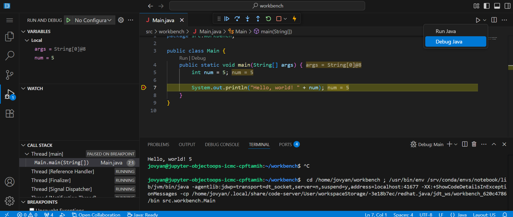

# <DateTitle offset=1 />

[](https://mybinder.org/v2/gh/ObjectOops/icmc/HEAD?urlpath=vscode)

- Review basic data types
- Number bases, computer memory, binary, hexadecimal
- Rounding Errors
- Characters, ASCII
- *Break*
- Using Debuggers
- Understanding the scanner buffer
- Operators and Casting
- *Worksheet*

---
src: ../day01/day01.md#16
---

---
src: ../day01/day01.md#17
---

---
src: ../day01/day01.md#18
---

---

## Number Bases

<v-clicks depth=2>

- Most of the time, we use the **base 10** (decimal) number system
- For a number like $123$, we can see that $1*10^2+2*10^1+3*10^0=1*100+2*10+3*1=123$
  - Each digit is multiplied by <span v-mark.highlight.pink="3">powers of 10</span>
  - Start with $10^0=1$ on the right, and move to the left
  - Increase the power for each digit until reaching the leftmost digit
- Other number bases exist!

</v-clicks>

<!-- Note to younger students that it's okay if they don't have the math background. This is a slightly more advanced topic for older students, since we have such a large age range (as of time of creation of these slides). -->

---

## Computer Memory

<v-clicks depth=3>

- Computers are made of tiny circuits called **transistors**
  - A transistor is controlled by *electrical voltage*:
    - High voltage <carbon-arrow-right /> `1`
    - Low voltage <carbon-arrow-right /> `0`
    - <span text-sm>If it's not `1` or `0`, then something is *very* wrong in the computer</span>
- Computers use <span v-mark.underline.pink="5">billions</span> of transistors to represent data

</v-clicks>
<v-click>


</v-click>

---

### Integers

<v-clicks>

<span v-mark.underline.pink="1">Binary represents integers in **base 2**.</span>

#### Base 2 to Base 10 - Exercises

Convert the binary number $11110110010_2$ from base 2 to base 10.

$$
1\rightarrow 1*2^{10}
1\rightarrow 1*2^{9}
1\rightarrow 1*2^{8}
1\rightarrow 1*2^{7}
0\rightarrow 0*2^{6}=0
1\rightarrow 1*2^{5}
1\rightarrow 1*2^{4}
0\rightarrow 0*2^{3}=0
0\rightarrow 0*2^{2}=0
1\rightarrow 1*2^{1}
0\rightarrow 0*2^{0}=0
2^{10}+2^{9}+2^{8}+2^{7}+2^{5}+2^{4}+2^{2}=1970
$$

````md magic-move
```
11111101001 = ?
```
```
11111101001 = 2025
```
````

````md magic-move
```
1111011 = ?
```
```
1111011 = 123
```
````

</v-clicks>

<!-- Work through the exercises before showing answers. -->

---

<v-clicks>

#### Base 10 to Base 2 - Exercises

<v-clicks>

- To go from base 10 to base 2, we need to use the remainder when dividing.
  - $10\div 3=3\text{ remainder }1$
- We only want the remainder. We have an operation for this called the **modulo**.
  - We use the symbol `%` to represent the modulo.
  <span text-sm>This symbol is often used to represent percentages, but we are not using it for that.</span>

</v-clicks>

Convert the number $1970_{10}$ from base 10 to base 2.

$$
\text{Take the number and mod it by 2. Then, divide the number by 2 and repeat until you reach zero. Remove any digits past the decimal point after dividing by 2.}
1970\% 2=0
985\% 2=1
492\% 2=0\text{ 985/2=492.5, but we don't care about the 0.5}
246\% 2=0
123\% 2=1
61\% 2=1
30\% 2=0
15\% 2=1
7\% 2=1
3\% 2=1
1\% 2=1
0\% 2=0
\text{Then, starting from the bottom of the column of numbers, write down each modulo result.}
\Rightarrow 011110110010
\Rightarrow \ 11110110010
$$

````md magic-move
```
456 = ?
```
```
456 = 111001000
```
````

<span v-mark.highlight.red>This method **only works with positive integers or zero**.</span>
<span text-sm>Visit this page to learn how to represent negative integers in binary: [en.wikipedia.org](https://en.wikipedia.org/wiki/Two%27s_complement)</span>

</v-clicks>

<!-- Work through the exercises before showing answers. -->

---

<v-clicks>

#### Base 16 - Hexadecimal

<v-clicks depth=2>

- Binary (base 2) is hard to read
  - Programmers need a number system that's easy to use like base 10, but easier to convert to base 2
- In base 10, a digit can be from 0 to 9
  - In base **16**, a digit can be from 0 to 15
  - We use the characters A, B, C, D, E, and F to represent digits with values from 10 to 15
  - Base 16 is also called **hexadecimal**
- Example: $1970_{10}=7B2_{16}$
    - $7*16^2+B*16^1+2*16^0=7*16^2+11*16^1+2*10^0=1970$

</v-clicks>


To convert from base 2 to base 16 <span text-sm>(and base 16 to base 2)</span>, simply use the table above!
```
1970 = 
0111 1011 0010
   7    B    2
```

````md magic-move
```
1000 = 3E8 = ?
```
```
1000 = 3E8 = 0011 1110 1000
```
````

````md magic-move
```
2025 = 0111 1110 1001 = ?
```
```
2025 = 0111 1110 1001 = 7E9
```
````

</v-clicks>

<!-- Work through the exercises before showing answers. -->

---

<v-clicks>

- Other number bases that are commonly used in programming are base 8 (octal) and base 64
- We can use Python to help us with converting between various number bases

<div>

<logos-python />

```python {monaco-run} {autorun:false}
decimal = 1234567890

binary = bin(decimal)
hexadecimal = hex(decimal)
octal = oct(decimal)
base64 = base64.encode(decimal)

print(f"""
decimal: {decimal}

binary: {binary}
octal: {octal}
base64: {base64}
""")
```

```python {monaco-run} {autorun:false}
some_number = "F4240"
number_base = 16

decimal = int(some_numer, number_base)

print(f"{some_number} in base {number_base} is {decimal} in base 10!")
```

</div>

</v-clicks>

<!-- Switch bases in second demo. -->

---

#### Integer Limits

<v-clicks>

How big of a number can we have?

```python {monaco-run} {autorun:false}
big_number = 9999999999999999999999999999999999999999999999999999999999999999
print(big_number)
```

In Python, numbers can be practically as big as you want them to be.

What about Java?

```java {monaco-run} {autorun:false}
public class Main {
    public static void main(String[] args) {
        int bigNumber = 9999999999999999999999999999999999999999999999999999999999999999;
        // int bigNumber = 2147483647;
        // int bigNumber2 = bigNumber + 1;
        
        System.out.println("bigNumber: " + bigNumber + ", bigNumber2: " + bigNumber2);
    }
}
```

<v-clicks depth=2>

- In Java, integers declared with `int` are *32-bit signed integers*.
- This means, for positive integers, we only have **31** binary digits!
- $2147483647_{10}$ is $1111111111111111111111111111111$ in binary
  How many `1`s are there?
  - There are exactly 31 `1`s.
  - If we try to make the number any bigger, even by adding 1, we will **overflow**
- The 32nd binary digit is a special digit that indicates if the integer is negative.
  That's why we only have 31 digits to use!

</v-clicks>

</v-clicks>

<!-- Also demonstrate using `long`. -->

---

### Floating-Point

Representing floating-point numbers like $123.456$ is too complicated to cover here.  
If you're curious, you can visit this site: [en.wikipedia.org](https://en.wikipedia.org/wiki/IEEE_754)

<v-clicks>

```python {monaco-run} {autorun:false}
numb = 0.1 + 0.2
print(num)
```

<v-clicks>

- Computers use *scientific notation* to represent floating-point numbers
  - Accurate enough, but not perfect!
- This small difference from the correct value is called a **rounding error**

</v-clicks>

</v-clicks>

---

### Characters

<v-clicks>

- Computers can only store data in binary
  - We've seen how integers are represented in binary
- What about characters? (Guesses?)
- Assign each character a number
  - This is called a **character encoding**
- ASCII is the base of most other character encodings

#### The ASCII Table


Exercise: ASCII values for...  
'A': <v-click>65</v-click>  
'a': <v-click>97</v-click>  
'=': <v-click>61</v-click>  
Which character corresponds with the value 32?  
<v-click><carbon-right-arrow /> A space!</v-click>

```python {monaco-run} {autorun:false}
# Convert a character into its ASCII code.
ascii_code = ord('J') # The quotes '' are needed. 

# Convert an ASCII code into its character.
c = chr(80)
print(c)
```

</v-clicks>

---

## Break

Have a break!

<RandomPicture />

---

## Using Debuggers

> <span text-sm>Instructor Guided</span>



<!-- Instructor should perform interactive guide in external environment. -->

---

## The Scanner Buffer

<v-clicks>

What does the following code output?

<logos-java /> <span text-sm>(only applies to Java)</span>

```
Scanner scan = new Scanner(System.in);

int num = scan.nextInt();
String someString = scan.nextLine();

System.out.println("num: " + num + ", someString: " + someString);
```

Sample Output:
`num: 5, someString: `

The variable `someString` is empty because of **buffering**.

<v-clicks depth=2>

- What character is at ASCII code 10?
  - The `LF` character is called the **l**ine **f**eed or **newline** character
  - It is an *invisible character*, so the table labels it as "LF".
  - In this case, it represents that you have hit the <span v-mark.underline.pink>enter key</span>
- A **buffer** stores characters before they can be used by the program
  - When we entered 5 in the example above, the buffer looked like this:
  `5<LF>`
  - After `scan.nextInt()`, the buffer looked like this:
  `<LF>` <span text-sm>(the character '5' was *consumed*)</span>
  - When we entered a string like "hello" afterwards, the buffer became:
  `<LF>hello<LF>` <span text-sm>("hello<LF>" was inserted after the first "<LF>")</span>
  - When calling `scan.nextLine()`, the <span v-mark.underline.pink>scanner gets characters until the first `<LF>`</span>
  - Finally, the buffer looks like this:
  `hello<LF>` <span text-sm>(only the first "<LF>" was consumed)</span>
  And the value of `someString` is an empty String, because there were no characters before the first LF 

</v-clicks>

To fix this, add a `scan.nextLine()` after reading the integer:
```java
Scanner scan = new Scanner(System.in);

int num = scan.nextInt();
scan.nextLine(); // Add this.
String someString = scan.nextLine();
```

</v-clicks>

<!-- Demo the example code. Some modifications may be needed to run in external environment. -->

---

## Operators

<v-clicks depth=2>

- We have already seen the assignment operator (`=`) and the addition operator (`+`)
- There are many other operators

  - We will gradually learn more about them
  - For full descriptions, visit this site: [docs.oracle.com](https://docs.oracle.com/javase/tutorial/java/nutsandbolts/opsummary.html)
- The *order of operations* generally applies in programming the same way as in algebra
  - Multiplication (`*`) has higher precedence over addition (`+`)
  - Put your expressions inside parenthesis [`(1 + 2) * 3`] to given them higher precedence

</v-clicks>
<v-click>

<logos-python /><span text-sm>(using Python here, but it also applies to Java)</span>

```python {monaco-run} {autorun:false}
num1 = 5
num2 = 6
num3 = 2 + num1 * num2
print(num3)
```

</v-click>

<!-- Try some operators in the demo. -->

---

## Casting

<v-clicks>

- To convert one data type to another data type, we can often use **casting**
- <span v-mark.highlight.red="2">Casting is different between Java and Python</span>

</v-clicks>
<v-click>

### Example - Java

Put `(type)` (where `type` is a data type) before a variable to cast it to another type.

```java {monaco-run} {autorun:false}
public class Main {
    public static void main(String[] args) {
        double num = 3.14159;
        // Print the original `num`, but also casted to an integer.
        System.out.println("num: " + num + " " + (int)num);
        
        int num2 = (int)num;
        // Casting to a String is a bit different:
        String numString = Double.toString(num); // `Double` is uppercase!
        String numString2 = Integer.toString(num2);
        System.out.println("strings: " + numString + " " + numString2);
        
        // Casting from a String to other data types:
        String numString3 = "123";
        int num3 = String.valueOf(numString3);
        System.out.println("num3: " + num3)
    }
}
```

</v-click>
<v-click>

### Example - Python

The same examples above, but in Python.  
Similar to Java, but casting takes the form `type(value)`.

```python {monaco-run} {autorun:false}
num = 3.14159
# Print the original `num`, but also casted to an integer.
print("num:", num, int(num))

# Casting to a String is a bit different:
num_string = str(num) # `str` is short for "string".
print("string:", num_string)

# Casting from a String to other data types:
num_string_2 = "123"
num2 = int(num_string_2)
print("num2:", num2)
```

</v-click>

<!-- They should recall that casting from strings to other types in Python is the same process as converting bases. -->

---

## Worksheet

[Click here to access the worksheet.](worksheets/worksheet01/worksheet01.pdf)

[Click here to access the answer key.](worksheets/worksheet01/answers01.pdf)


